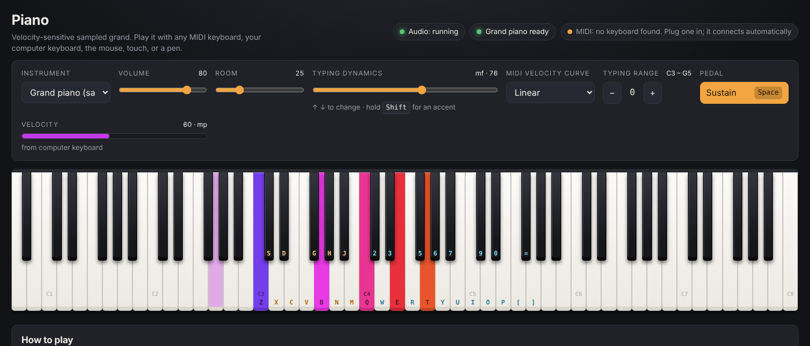

# Piano

A velocity-sensitive grand piano that runs entirely in your browser. No install, no
build step, no server: open `index.html` and play.



## Play it

1. Open `piano/index.html` in Chrome, Edge, Firefox or Safari (double-click it, or
   serve the folder with `npm start`).
2. Click, tap or press any key once. Browsers only start audio after a gesture; the
   app connects your MIDI keyboard at the same moment.

The grand piano samples decode in about a second. Until they are ready the synth
piano plays, then the sampled piano takes over automatically.

### With a MIDI keyboard (real velocity)

Plug in any class-compliant USB or Bluetooth MIDI keyboard and click **Connect MIDI**
if the browser asks for permission. Every note uses the velocity your keyboard
sends, and the sustain (CC 64), sostenuto (CC 66) and soft (CC 67) pedals work.
Keyboards can be plugged in or swapped while the page is open; they are picked up
automatically. All 16 MIDI channels are listened to.

If your keyboard feels too heavy or too light, change **MIDI velocity curve**:
*Softer* makes a stiff keyboard reach loud notes more easily, *Harder* gives a light
keyboard more room at the quiet end.

Web MIDI works in Chrome, Edge, Opera and Firefox. Safari does not support it; the
computer keyboard, mouse and touch still work there.

### With the computer keyboard

Two rows of white keys with the black keys on the row above them, laid out like a
piano. Physical key positions are used, so AZERTY, QWERTZ, Dvorak and other layouts
play the same shapes (the labels on the keys follow your real layout in Chrome and
Edge).

| Keys | Plays |
|------|-------|
| `Z` `X` `C` `V` `B` `N` `M` `,` `.` `/` | white keys C3 to E4 |
| `S` `D` `G` `H` `J` `L` `;` | black keys above them |
| `Q` `W` `E` `R` `T` `Y` `U` `I` `O` `P` `[` `]` | white keys C4 to G5 |
| `2` `3` `5` `6` `7` `9` `0` `=` | black keys above them |
| `Space` (hold) | sustain pedal |
| `Shift` (hold) | accent: strike the note harder |
| `↑` `↓` | typing dynamics, from *pp* to *ff* |
| `←` `→` | shift both rows an octave |
| `Esc` | silence everything |

A computer keyboard cannot sense pressure, so the **Typing dynamics** slider sets
how hard typed notes are struck; the arrow keys step through *pp, p, mp, mf, f, ff*
and Shift adds an accent on top. For true per-note velocity use a MIDI keyboard.

### With the mouse, touch or a pen

Hit a key near its front edge for a loud note and near the top for a soft one, the
way a real key lever responds. Drag across the keys for a glissando. Several
fingers at once play chords. Pens and pressure-sensitive screens use real pressure
(and Force Touch trackpads in Safari).

## Sound

- **Samples:** Salamander Grand Piano V3 (a Yamaha C5) by Alexander Holm, CC BY 3.0.
  Thirty notes a minor third apart, four velocity layers each (pp, mp, f, ff).
- **Velocity:** picks the pair of layers around the struck velocity and crossfades
  them with equal power, so a soft note uses a genuinely soft recording rather than a
  quiet loud one. Below the softest layer the sound is scaled down and darkened.
- **Mechanics:** damper release times that lengthen toward the bass, no dampers on
  the top octave and a half (as on a real piano), sustain, sostenuto and soft pedals,
  and a little extra room resonance while the sustain pedal is down.
- **Space:** a synthetic stereo room (convolution reverb, "Room" slider), per-note
  stereo placement from bass on the left to treble on the right, and a soft limiter
  so big chords never clip.
- **Synth piano:** an additive, inharmonic piano model used while the samples decode
  or as an instrument in its own right.

Settings (volume, room, dynamics, MIDI curve, octave, instrument) are remembered
in your browser.

## Files

| File | What it is |
|------|------------|
| `index.html`, `style.css` | the page |
| `engine.js` | Web Audio engine: output bus, sampled piano, synth piano, pedals, voice management |
| `input.js` | computer keyboard, Web MIDI and pointer (mouse / touch / pen) handlers |
| `app.js` | UI wiring: on-screen keyboard, controls, status, settings |
| `samples.js` | the sample bank (120 MP3s embedded as base64, about 8 MB) |
| `tools/build-samples.mjs` | regenerates `samples.js` from the `@audio-samples/piano-mp3-velocity*` npm packages (needs `ffmpeg`) |
| `test/run.mjs` | headless-browser test suite |

The samples are embedded rather than loaded as separate files so that the page works
when opened straight from disk (browsers block `fetch` on `file://` URLs).

## Development

```sh
cd piano
npm install          # Playwright, for the tests
npm test             # drives the page in headless Chromium
npm run build:samples
```

The tests open `index.html` from `file://`, decode the bank, play notes through the
keyboard, MIDI and pointer paths, and render audio offline to check that velocity
really changes loudness and brightness, that pedals hold and release, that chords
do not clip, and that voices are cleaned up. A screenshot lands in `test-results/`.

## Credits

Piano samples: [Salamander Grand Piano V3](https://archive.org/details/SalamanderGrandPianoV3)
by Alexander Holm, licensed [CC BY 3.0](https://creativecommons.org/licenses/by/3.0/),
obtained through the `@audio-samples/piano-mp3-velocity*` packages by Jan Forst.
